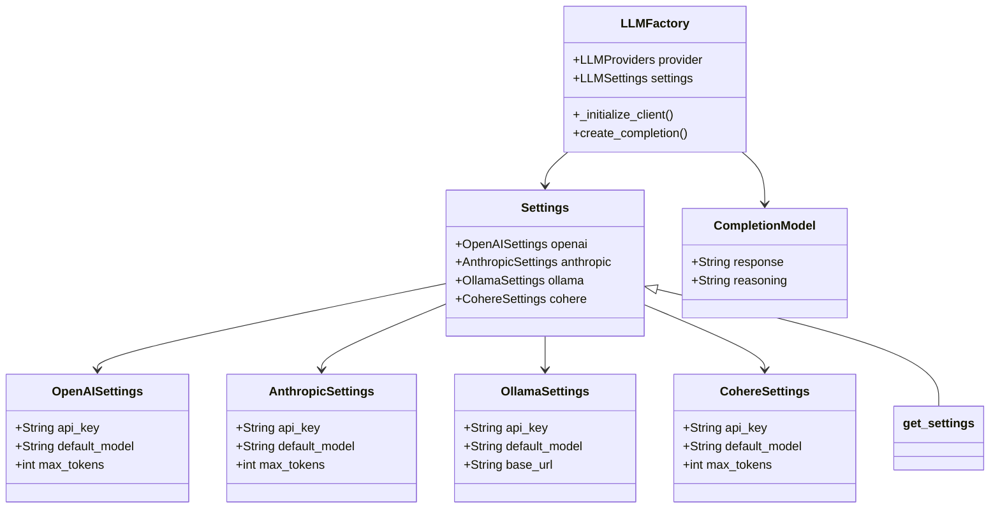

# LLM Factory Project

This project implements a simple factory pattern that allows you to dynamically choose different Language Model (LLM) providers. It uses the Instructor module under the hood for getting structured output.

## Features

- Supports multiple LLM providers: OpenAI, Anthropic, Cohere, and Ollama
- Dynamic selection of LLM provider at runtime
- Structured output using Pydantic models
- Caching of settings for improved performance
- Environment-based configuration using .env files

## Usage

To use the LLM Factory, follow these steps:

1. Set up your environment variables in a `.env` file with the necessary API keys for each provider.
2. Import the `LLMFactory` and `CompletionModel` from the `llmfactory` module.
3. Create an instance of `LLMFactory` with your chosen provider.
4. Use the `create_completion` method to generate responses.

Example:

```python
from llmfactory import llm_factory

messages = [
    {"role": "system", "content": "You are a helpful assistant."},
    {"role": "user", "content": "If it takes 2 hours to dry 1 shirt out in the sun, how long will it take to dry 5 shirts?"},
]

llm = llm_factory.LLMFactory("cohere")
completion = llm.create_completion(
    response_model=llm_factory.CompletionModel,
    messages=messages,
)

print(f"Response: {completion.response}")
print(f"Reasoning: {completion.reasoning}")
```

## Project Structure

- llmfactory/llm_factory.py: Contains the main LLMFactory class and CompletionModel.
- llmfactory/settings.py: Defines the settings for each LLM provider using Pydantic.
- main.py: Provides an example of how to use the LLM Factory.

## Class Diagram


